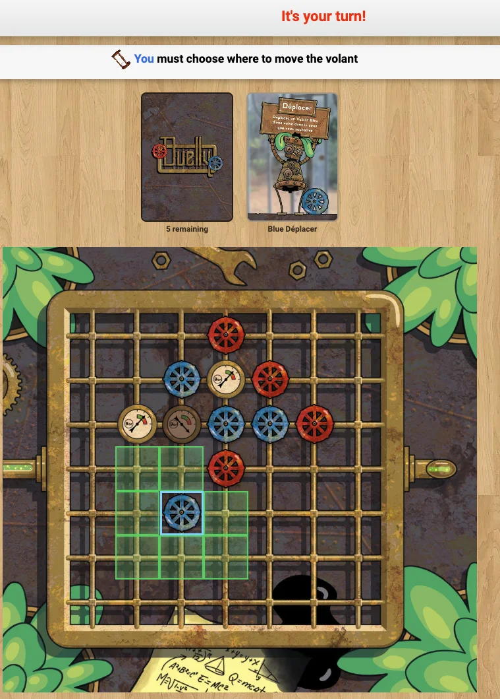

Comment fabriquer un skill qui livre vraiment ? Comment construire une boucle de test qui ferme ? Que décide un agent à votre place quand la spec se tait ? L'adaptation de jeux de société sur Board Game Arena m'a servi de cas d'étude — périmètre borné, framework contraint, validation immédiate. Un exemple : 10 avril 2026, à l'aide de ce skill j'ai pu laisser Claude partir d'une règle du jeu (tic-tac-toe quantique) pour obtenir un jeu complet en moins de 3 heures, sans écrire une seule ligne de code à la main. Quatre jeux plus tard, voici ce que j'en ai retenu.

Après la frénésie post-découverte de Claude Code, je me suis posé les mêmes questions que beaucoup : comment le piloter pour automatiser au maximum développement et tests ? Quelle méthode pour écrire les skills & autres outils de pilotage ? Quand doit-on se reposer sur des outils ou sur les capacités du modèle ? Plutôt plomberie ou permaculture comme prochain travail ?

Pour avancer sur ces questions, l'adaptation des jeux de plateau m'a paru un excellent terrain d'expérimentation : projets assez courts, feedback rapide, framework très contraint, produits généralement très bien définis comparativement à n'importe quel service SaaS (règles). Par ailleurs j'ai promis en 2023 à un ami d'adapter son jeu sur Board Game Arena « d'ici ~1 mois », la tension devient palpable...

**Objectif :** écrire un skill permettant à Claude Code de délivrer une adaptation de jeu de plateau directement à partir des règles. Comprendre les éléments de design et d'itération sur un skill destiné à sortir un produit fini.

## Premiers pas

Par bonheur BGA (Board Game Arena) utilise PHP, un langage avec lequel je n'ai absolument aucune affinité. Un terrain idéal pour développer « sans toucher ni regarder une seule fois au code ».

Les premiers essais sont intéressants : les questions sont automatiquement extraites et envoyées aux auteur.ices, une première version du code est produite, un premier plateau est généré automatiquement en SVG, tout semble ok, premier déploiement...

Rien ne fonctionne ! Il n'est même pas possible de lancer une partie !

Les messages d'erreurs ne s'affichent que quelques secondes dans le navigateur et tenter de les copier/coller avant leur disparition est une course contre la montre rapidement désagréable.

Agacé par cette étape répétitive, inintéressante et couronnée d'échec, je médite et me souviens des trois vertus cardinales du programmeur : la Paresse, l'Impatience et l'Orgueil. Cela me permet de me pencher immédiatement sur l'automatisation de toute la chaîne du déploiement aux tests à l'aide de Claude in Chrome. Cette erreur était plutôt désagréable, mais la boucle « déploiement → test → capture du message d'erreur → correction » est quelque chose dont j'aurais longtemps rêvé si j'avais envisagé cette possibilité ! Par la suite j'ai utilisé ce même principe pour tester toutes les règles avec des parties complètes.

Cependant les heures suivantes n'ont pas permis de débloquer la situation : le projet avait été démarré avec une version obsolète du framework BGA. N'ayant pas mis les mains dans le code, je n'avais pas vu cela. Le déblocage s'est fait en changeant d'approche : plutôt que tenter de faire marcher ce code, j'ai repris un code d'exemple, vérifié qu'il lançait bien une table, et demandé à Claude de « porter » progressivement le code du jeu vers ce code d'exemple en testant régulièrement le bon fonctionnement. Cela aura pris ~20 minutes, sans intervention de ma part.

Dans sa version actuelle le skill présente donc les choix suivants :
- On démarre par télécharger le code « de base » pour partir de ce point. Si le framework change, le skill aura toujours la dernière version.
- La boucle de test est intégrée et prévue pour fonctionner avec des événements dans le DOM plutôt que des captures d'écran analysées par Claude. Cela autant pour accélérer que pour réduire l'usage de Claude Code.

## Première leçon : La progressivité paie

« It is faster to make a four-inch mirror and then a six-inch mirror than to make a six-inch mirror. » [source](https://wiki.c2.com/?TelescopeRule=&utm_source=chatgpt.com)

Le premier jeu choisi, **Go On Rasalva** (un jeu dont je suis co-auteur, pas encore disponible), était assez complexe : plateau hexagonal avec une répartition des couleurs délicate à décrire, gestion de ressources, ordre du tour changeant, placement et transformations, etc. J'avais simplement choisi le jeu initialement promis en 2023 pour de simples raisons de pression sociale...

Mais en considérant l'objectif réel, l'automatisation de ce type de développement, j'ai rapidement compris que j'irais probablement plus vite en testant vraiment plus simple. J'ai donc relancé le travail sur tic-tac-toe, avec l'objectif d'avoir un jeu jouable et testé de A à Z par Claude Code.

Cette démarche s'est avérée payante et j'ai continué avec d'autres jeux disponibles en augmentant graduellement les features (gestion d'un paquet de cartes, différentes interactions utilisateur...) : tic-tac-toe quantique ([ici](https://boardgamegeek.com/boardgame/171143/quantum-tic-tac-toe)), Visite Royale ([ici](https://boardgamegeek.com/boardgame/22245/royal-visit)), Duelly ([GitHub](https://github.com/rbellec/bga_duelly), terminé de bout en bout — publication en attente d'un point de licence). Chaque adaptation permettait d'améliorer graduellement le skill en réalisant le process de bout en bout pour, au final, revenir au premier jeu avec un process déjà validé qu'il suffirait d'améliorer.

La question du transfert de cette réalisation à d'autres domaines reste ouverte. Lorsque les projets sont bornés, avec un process similaire (comme l'adaptation des jeux), cela semble adapté. Dans d'autres domaines, comme l'évolution et la maintenance d'un service SaaS en production avec une surface fonctionnelle importante, une infrastructure complète et beaucoup de code legacy, je ne sais si cette approche est possible.

## Quand l'IA n'y arrive pas / est biaisée

Go On Rasalva comportait un plateau hexagonal avec un schéma de coloration particulier que je n'ai pas réussi à décrire. Que ce soit à Claude Code ou ChatGPT, j'obtenais systématiquement une coloration « alternée » des cases, comme sur un damier. J'ai tendance à nommer cela « des problèmes 10h10 », en référence aux générateurs d'image qui ne savent présenter que des montres à 10h10.

Dans le cas présent je n'ai pas trouvé d'autre méthode que fournir un code comme spécification. J'avais réglé ce sujet en Haskell il y a quelques années et cela a suffi pour qu'il soit immédiatement transcrit en PHP. Je pense garder l'idée du code dans la spécification dans ce type de cas pour le futur, mais je me questionne sur le nombre de problèmes de ce type existants.

L'autre versant de la même difficulté : quand Claude Code tombe dans un piège propre au framework, s'en sortir sans connaissance du domaine est délicat. Il peut tourner longtemps sur la même erreur sans progresser. Ce qui est frappant, c'est qu'il lui arrive de s'en sortir seul par un chemin latéral auquel je n'aurais pas pensé — mais c'est encore au pilote de repérer le signal de blocage avant que l'énergie dépensée ne devienne le vrai problème.

## Hallucinations / interprétations

Lors des premiers tests humains, un comportement nous a fortement surpris : tous les jeux produits ont des « comportements par défaut » certes valables au regard des règles, mais inattendus. Par exemple, le code généré déplace automatiquement une ou plusieurs pièces d'une manière qui semble être la meilleure dans la majorité des cas, mais cela devrait rester une décision du joueur et il pourrait avoir une stratégie plus élaborée.

Lors des lectures de règles j'ai rencontré plusieurs « interprétations hâtives », même sur des règles bien définies.

Cette généralisation semble être un atout pour permettre de développer rapidement. Cela revient cependant à laisser des choix structurants à l'IA. Cela se voit rapidement quand il s'agit d'un jeu, mais semble être un champ de travail complet pour des logiciels plus complexes : quels choix « automatiques » peut-on accepter sur un SaaS qui traite des paies par exemple ? Comment détecter ce qui devrait être défini vs ce que l'on peut laisser à l'IA ? Je n'ai pas d'opinion tranchée à ce stade et pense traiter le résultat de l'IA comme un premier jet qui nourrit le product discovery.

Un comportement connexe, moins critique mais récurrent : Claude Code donne parfois des conseils qui seraient tout à fait pertinents pour une équipe humaine — *« il vaudrait mieux livrer cette version stable et itérer ensuite »*, *« ce refacto représente plusieurs jours de travail »*. Ces recommandations font peu de sens quand la feature en question prend cinq à dix minutes et que la valeur est réelle. J'ai l'impression que ce biais apparaît surtout quand la demande *ressemble* à du travail d'équipe sérieux — une demande de refacto ou d'architecture — plutôt qu'à de l'exploration. D'autres ont noté le même phénomène.

## Quand les règles ne disent rien

Différence essentielle avec la section précédente : ici, l'IA n'invente pas, le code n'est pas en cause. Tout simplement, **les règles ne disent rien**. Elles sont parfois incomplètes ou ambiguës, et c'est normal — un livret de règles n'a jamais été écrit pour servir de spécification. C'est un document pédagogique destiné à des joueur.euses humain.es qui peuvent porter l'ambiguïté dans leur tête, demander autour de la table, ou improviser un compromis. Le code n'a aucune de ces options : chaque cas doit être tranché explicitement.

J'ai donc adopté un workflow simple, précisé au fil des jeux. Le skill demande à Claude de produire trois fichiers distincts plutôt qu'un seul :

- `RULES.md` — reformulation fidèle du PDF, sans interprétation. C'est ce qu'on peut relire pour vérifier qu'aucun élément n'a été dévié.
- `ASSUMPTIONS.md` — chaque décision d'interprétation reçoit un identifiant `[Hx]` et est référencée dans le code (`// [H11] Victoire vérifiée avant action de bloqueur`).
- `AUTHOR_QUESTIONS.md` — chaque ambiguïté résiduelle devient une question explicite, avec un statut (OPEN, ASSUMED, CLOSED) et une catégorie (RULES-AMBIGUOUS, RULES-MISSING, RULES-IMPLICIT...).

Le document `AUTHOR_QUESTIONS.md` est envoyé aux auteur.ices. À chaque retour, un statut bascule, parfois une hypothèse `[Hx]` saute, parfois c'est tout un sous-système qui disparaît avant même d'avoir été implémenté.

**Exemple concret sur Duelly.** Le livret mentionne des cartes « Joker » qui pouvaient s'appliquer dans plusieurs situations — y compris sur un coup gagnant. Une question simple : *« Le Joker s'applique-t-il sur un Déplacer gagnant ? »*. La réponse des auteurs a été inattendue : *« En fait pour tout simplifier, on annule complètement les Jokers. »* Effets immédiats : un état du jeu, une colonne en base, un indicateur d'UI et une branche de la condition de victoire — tous supprimés avant d'avoir été codés. Quelques heures de travail économisées par une question écrite en deux minutes.

Cette partie du workflow n'est pas spécifique à l'IA : un développeur humain qui adapte un jeu pose les mêmes questions. La différence, c'est que le workflow IA *force* l'explicitation. Un humain peut tenir l'ambiguïté dans sa tête en attendant que la situation se présente ; un agent ne le peut pas, et c'est cette contrainte qui produit la trace écrite, auditable, donc utile pour les auteur.ices.

## Construction progressive du skill

La construction du skill s'est globalement faite en deux parties :
- Une architecture générale avec des comportements, des liens vers les documentations et des « process » (comme commencer par transcrire les règles du PDF vers du markdown)
- Une construction « réactive », façon **registry of regrets**, où chaque règle est issue d'une correction d'incident.

J'hésite à proposer aux potentiels utilisateurs de pouvoir ajouter leur règle automatiquement : si Claude rencontre une erreur qui pourrait être résolue par l'ajout d'une règle, on propose à l'utilisateur de l'amender et d'envoyer une PR automatiquement.

Pour prévenir les sujets de taille de contexte, j'ai séparé le skill en plusieurs fichiers. J'imagine pour le moment qu'une course entre l'ajout de règles et l'augmentation des tailles de contexte des modèles nous laisse de la marge avant d'optimiser ce sujet.

Un mot sur les worktrees git : leur utilisation est vraiment agréable, mais elle se heurte à la petite taille de ces projets. Chaque tâche modifie beaucoup de code commun — les worktrees finissent par attendre les uns les autres, ce qui réduit l'intérêt du travail en parallèle.

### Exemple de piège

Lors de la réalisation du tic-tac-toe quantique (QTTT), Claude a passé plus d'une heure sur une seule erreur, silencieuse, tapie dans l'ombre, sournoise... (on a trop peu l'opportunité d'utiliser l'écriture dramatique dans ce métier. Je profite de cette occasion).

Lorsque BGA Studio traite le modèle de base de données `dbmodel.sql` (un seul fichier, pas de notion de migrations), il commence par supprimer tous les retours à la ligne à l'intérieur des instructions avant d'envoyer le résultat à MySQL en une seule chaîne.

```sql
-- Avant suppression des retours à la ligne :
CREATE TABLE `t` (
  `a` INT NOT NULL,   -- première colonne
  `b` INT NOT NULL,
  PRIMARY KEY (`a`)
) ENGINE=InnoDB;
```

devient, pour MySQL :
```sql
CREATE TABLE `t` (  `a` INT NOT NULL,   -- première colonne  `b` INT NOT NULL,  PRIMARY KEY (`a`)) ENGINE=InnoDB;
```

MySQL coupe donc l'instruction après le début du commentaire, crée la première colonne, retourne `success` sans même qu'un warning arrive jusqu'à nous. Le premier symptôme apparaît à l'exécution sous la forme d'un `Unknown column 'b' in 'field list'` quand le code tente l'accès à cette colonne.

La documentation BGA précise « if you use comments, then you must not do it in the same line as the code », ce qui est typiquement la ligne que l'on trouve APRÈS avoir compris l'erreur. Les humains ont probablement encore un avantage sur les IA sur ce sujet car je n'en connais aucun qui commente les lignes de ses requêtes SQL ! Les autres tomberont sur ce problème très vite.

Deux autres problèmes du même registre — silencieux, fragiles à diagnostiquer — sont apparus pendant l'aventure :

- `getCollectionFromDb($sql)` indexe le tableau PHP retourné par la première colonne sélectionnée. Si elle n'est pas unique, les lignes suivantes écrasent silencieusement les précédentes. `SELECT square1, square2 FROM q_moves` a perdu la moitié du graphe d'intrication. Techniquement un modèle (et probablement un développeur) devrait reconnaître là une API PDO (PHP Data Objects) là où le framework en fait une interprétation propre.
- Une collision avec un nom de table interne au framework. La documentation officielle liste 4 tables réservées (`global`, `stats`, `gamelog`, `player`, plus tout préfixe `bga_`). En testant empiriquement pendant la rédaction de cet article, j'en ai trouvé au moins une cinquième : `replaysavepoint`, sans préfixe `bga_`, créée par le framework au démarrage. Si vous redéclarez ce nom dans `dbmodel.sql`, votre schéma est silencieusement écrasé par celui de BGA — exactement le même comportement que pour les 4 tables documentées. *Au passage, en faisant ce test, je me suis aussi rendu compte que `moves` — que j'avais cru réservée et préventivement renommée sur QTTT — ne l'était pas. C'était simplement le bug de commentaires SQL inline raconté plus haut. Le rename `moves → q_moves` n'aura servi à rien, mais il aura inspiré la moitié du `[Hx]` « ne pas redéclarer une table interne » du skill.*

**Un autre piège silencieux du même genre, mais à un étage différent.** Claude Code avait testé toutes les règles d'un jeu via la boucle DOM — pose, déplacement, victoire, tout au vert. Au premier test humain, surprise : *aucune pièce ne répondait au clic*. Le mécanisme de test, qui passe par `gameui.ajaxcall` pour déclencher les actions du framework, n'avait jamais exercé le chemin souris→pièce. La boucle de test certifie ce qu'elle teste, et seulement ça : la logique métier était bonne, l'interaction ne l'était pas. Le test humain reste, pour l'instant, le seul à attraper cette catégorie de bug.

## Adaptation graphique

Je m'attendais à passer du temps sur l'intégration des assets graphiques — c'est souvent là que les adaptations BGA deviennent laborieuses (pour moi du moins, ce n'est pas ma partie favorite). La réalité a été différente : Claude Code a réalisé toutes les adaptations graphiques de Duelly, y compris l'analyse des fichiers source par OCR, sans que j'aie à mettre les mains dedans. Je ne saurais compter le temps que ça a pris, mais je dirais ~3 à 4h du début à la fin en comptant les discussions avec l'autrice. 80% du travail ayant été fait en moins de 30 minutes.



Un calibrage utile : avec un outil bien rodé, une autrice particulièrement réactive qui a fourni tous les assets et répondu aux questions de règles, et un jeu de complexité raisonnable, l'adaptation complète — code et graphismes — aura pris environ quatre jours à temps plein. Pour des équipes qui font régulièrement ce type d'adaptation et ont leur propre process, le gain devrait être considérable. Pour quelqu'un qui se lance sans repères, les outils facilitent vraiment le code et l'analyse des règles, mais je ne pense pas qu'on descende facilement sous une semaine — surtout si les échanges avec l'auteur·ice ou les assets graphiques doivent attendre.

Une limite que je n'avais pas anticipée : sur BGA, les traductions ne sont disponibles qu'à partir du passage en alpha — impossible de travailler la localisation en amont. Et plus fondamentalement, les illustrations des cartes de Duelly sont entièrement en français. Pour internationaliser vraiment le jeu, il faudrait refaire les assets soit avec un texte neutre ou localisable, soit avec un réel travail pictographique. Ce n'est pas dans mon scope d'adaptation, mais c'est une leçon concrète pour l'autrice : un jeu pensé pour l'international dès la conception s'économise ce chantier d'illustration.

## Quelques chiffres

Audit du repo Quantum Tic-Tac-Toe le 2026-04-28 :

- **~1080 lignes de code** (PHP 679, JS 271, SQL 23, CSS 105) — hors scaffold BGA et fichiers de configuration JSON.
- **~49 minutes entre le commit initial et le premier fix** qui corrige deux bugs sur trois. Le troisième bug — l'indexation par première colonne dans `getCollectionFromDb` — s'est manifesté le lendemain matin, ~11h plus tard. Le « **premier jeu en ~3h** » est donc plausible si on inclut la phase de mise en place avant le commit initial, mais il faut bien comprendre qu'il s'agit du **premier jeu jouable de bout en bout**, pas du premier jeu sans aucun bug.
- **3 bugs corrigés via la boucle de test** : commentaires SQL silencieux, collision de nom de table, et `getCollectionFromDb`. Tous tracés dans les commits, donc vérifiables.
- **~15 cycles déploiement → test → correction** et **~5 interventions humaines** (mise en place de la clé SSH, Express Stop sur des tables coincées, reconnexion de l'extension navigateur).

Ces chiffres mesurent une variante **simplifiée** des règles de Goff (résolution des victoires simultanées par « lowest maximum subscript » plutôt que par le partage de point décrit dans l'article original), avec un skill qui n'avait pas encore intégré les leçons des jeux suivants. C'est la mesure d'une rampe d'accès, pas d'un débit reproductible ni d'une annonce comme « faites n'importe quel jeu de plateau en 3 heures ». Je reste cependant impressionné.

Audit du repo Duelly le 2026-05-04 — jeu complet avec cartes, animations, statistiques et internationalisation :

- **~3 025 lignes de code** (PHP 1 811, JS 923, CSS 271, SQL 20) — environ 3× le volume de QTTT, pour un périmètre fonctionnel bien plus riche.
- **94 commits sur 8 jours actifs** répartis sur ~3 semaines calendaire (15 avril → 4 mai), avec des creux dus aux échanges avec l'autrice et aux sessions de tests humains.
- **Répartition **: 20 fix, 14 feat, 7 refactor, 15 ui/i18n, 24 chore/docs — reflet d'un jeu terminé de bout en bout, pas seulement « qui tourne ».

Ces chiffres incluent la passe qualité PHP et l'adaptation graphique complète. QTTT mesurait la rampe d'accès ; Duelly mesure ce que donne le process une fois rodé.

## Conclusion

Un premier travail vraiment intéressant : assez long pour que les pièges sortent du décor et que les bonnes pratiques s'installent.

Les jeux de plateau sur BGA Studio se sont avérés un terrain d'entraînement étonnamment précieux : périmètre fonctionnel petit (les règles), framework imposé, validation immédiate (la partie passe ou ne passe pas). Tout ce qui rend un service SaaS pénible à apprivoiser disparaît. Ce qui reste — la spec, les pièges du framework, la boucle de test — est net et visible. Cela m'a permis de voir des comportements spécifiques au développement avec Claude Code qui me seraient probablement passés sous le nez sur un projet plus large.

Une question courante, sans réponse encore : **à quoi sert la qualité du code quand un humain ne le lit plus ?** J'y ai passé du temps pendant le projet — refactos, nommage, réduction de dette — sans être certain que cela facilite les développements IA ultérieurs. La question reste ouverte.

Sur cinq jeux entamés, un seul est terminé de bout en bout : Duelly, en environ quatre jours à temps plein — code, graphismes et animations. L'autrice du jeu a été particulièrement réactive tout au long du projet, ce qui a beaucoup compté dans ce délai. La sortie publique du jeu se heurte pour l'instant à un deadlock administratif : il faut une inscription sur BGG pour demander une licence BGA, mais BGG souhaite réserver ses pages aux jeux physiques, et l'éditeur potentiel attend de voir si le jeu « marche » sur BGA avant d'envisager une édition.

Ce déplacement du goulot d'étranglement est bien réel : le code n'est plus le problème, c'est la disponibilité des auteur·ices et la coordination autour des tests humains qui ralentissent la chaîne.

Le [skill `claude-code-bga`](https://github.com/rbellec/claude-code-bga) est publié. J'espère des retours, des cas qui le cassent, des règles à ajouter, et plus largement des commentaires sur la démarche elle-même — c'est précisément le type de matière qui a fait évoluer le skill jusqu'ici.

